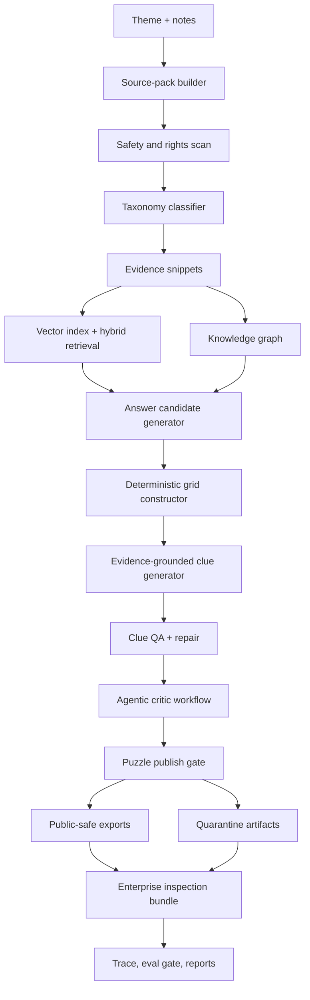
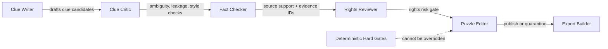
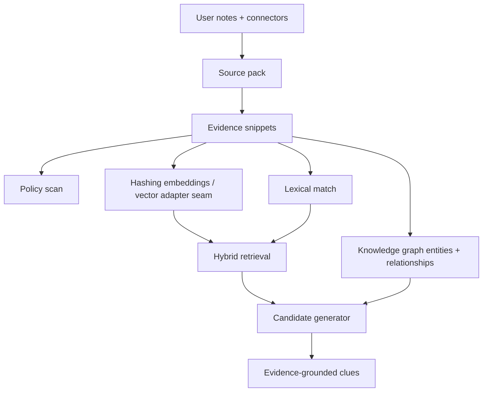
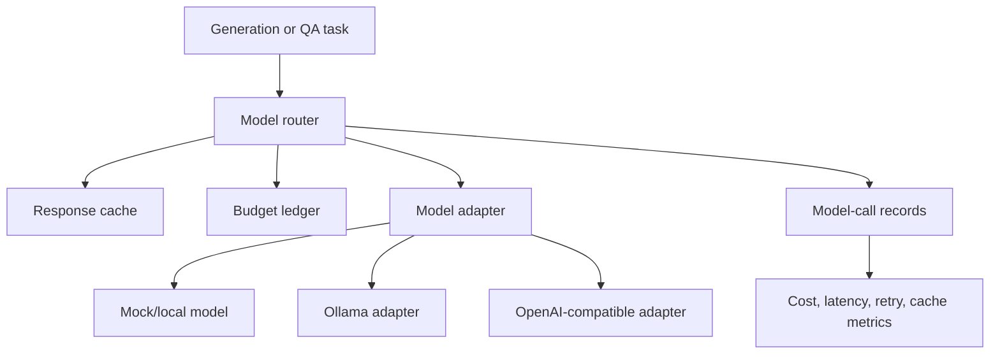
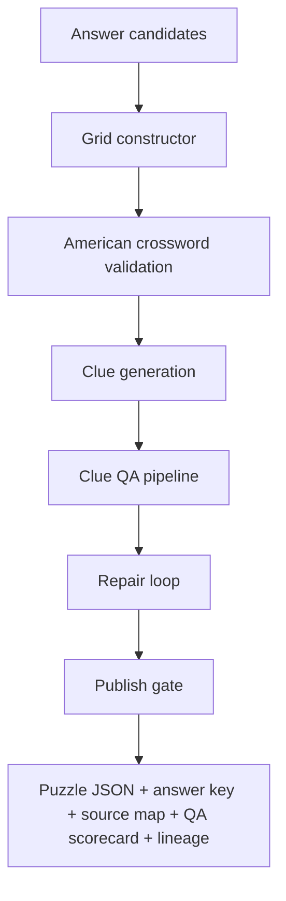
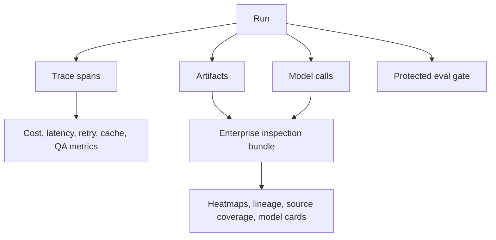

# CrosswordAI Generation Flow

This guide explains how CrosswordAI turns a theme into a publish-gated crossword artifact, which agents/checks own each step, and how the RAG, vector, model, admin, and local setup pieces fit together.

## System Flow



The hardened local core path is:

`source pack -> candidates -> grid -> clues -> QA -> exports -> observability -> protected eval gate`

Implemented entrypoint: `HardenedCorePathPipeline` in `src/crosswordai/core_path.py`.

## Agent Responsibilities



| Agent / Role | Owns | Cannot Override |
| --- | --- | --- |
| Clue writer | Drafts multiple clue styles and angles from answer + evidence. | Source evidence requirements. |
| Clue critic | Checks ambiguity, duplicate clues, answer leakage, style, and difficulty. | Grid legality and rights gates. |
| Fact checker | Confirms clue is grounded in evidence IDs/source snippets. | Missing or stale source support. |
| Rights reviewer | Blocks high-risk evidence and export leakage. | Public-safe export policy. |
| Puzzle editor | Records final decision and quarantine reasons. | Deterministic hard gates. |

Agent workflow implementation: `src/crosswordai/agents.py`.

## RAG, Vectors, And Knowledge Flow



Concise feature list:

- **Source packs:** normalize a theme, source documents, snippets, rights metadata, taxonomy metadata, and quality score.
- **Safety scan:** blocks prompt injection, long quotes, lyrics-like excerpts, scripts, long prose, and secret-like values.
- **Taxonomy:** routes themes such as music artists, media, technical topics, and general concepts toward preferred sources and stricter rights policy.
- **Vectors:** local hashing embeddings and hybrid retrieval exist now; pgvector/Postgres adapter work is the next production maturity path.
- **Knowledge graph:** stores entities, aliases, relationships, evidence IDs, and confidence scores for clue angles.
- **Retrieval evals:** protected suites measure recall, evidence precision, source diversity, stale sources, and failure clusters.

Key modules: `sources.py`, `safety.py`, `taxonomy.py`, `vectors.py`, `graph.py`, `retrieval_eval.py`.

## Model Use And Routing



Model features:

- Task routes map work such as clue generation, QA, judging, and repair to model adapters.
- Budget ledger blocks calls that exceed configured cost.
- Model-call records include route, model ID, prompt hash, output hash, latency, token estimates, cost, cache hits, and retries.
- Advanced routing supports shadow mode, cheap-first cascade, jury review, debate, self-play solver checks, and bandit routing.
- Experiment matrices compare models, prompts, routes, retrieval strategies, judge models, and repair strategies.

Key modules: `models.py`, `routing.py`, `experiments.py`, `promotion.py`.

## Generation And QA Features



Generation features:

- Answer candidates are deduped with vector similarity and source-support scoring.
- Grid validation checks rotational symmetry, connectivity, checked letters, minimum answer length, and duplicate answers.
- Clue generation supports direct, trivia, definition-only, cryptic-lite, classroom, easy, standard, and expert styles.
- Clue QA checks evidence, ambiguity, confidence, rights risk, answer leakage, duplicates, style, and difficulty.
- Publish gate quarantines any puzzle with hard-gate failures.
- Public-safe exports omit raw evidence quotes and include answer hashes, source maps, QA scorecards, model lineage, and quarantine reasons.

Key modules: `candidates.py`, `solver.py`, `clues.py`, `qa.py`, `exports.py`.

## Observability, Evals, And Reports



Features:

- Trace spans for workflow stages, model calls, retrieval calls, validators, exports, and run inspection.
- OTLP-shaped exporter seam, trace correlation records, dashboard metric payloads, and alert rules.
- Eval registry supports golden source packs, adversarial cases, protected regressions, and route comparisons.
- Enterprise reports include puzzle quality heatmap, clue lineage, source coverage, model contribution, taxonomy drift, puzzle cards, model cards, and quarantine postmortems.

Key modules: `observability.py`, `evals.py`, `reports.py`, `core_path.py`.

## UI Usage

There is no browser UI in this repository yet. The current usable interface is the CLI, and the report/export contracts are designed to support a future web UI.

Future app screens should map to these existing surfaces:

- **Create puzzle:** enter theme, upload notes, select sources, choose route/model strategy, start generation.
- **Source review:** inspect source pack, taxonomy, evidence snippets, rights status, and source quality.
- **Generation workspace:** view candidates, grid status, clue candidates, QA failures, repairs, and agent decisions.
- **Publish review:** inspect public-safe export, answer key, source map, QA scorecard, model lineage, and quarantine reasons.
- **Reports:** view heatmaps, clue lineage, source coverage, taxonomy drift, model contribution, and puzzle/model cards.
- **Batch lab:** submit many themes/routes, monitor progress, inspect checkpoints, compare routes, and export leaderboards.

CLI equivalents today:

```bash
python3 -m crosswordai source-pack build --theme "Miles Davis" --notes notes.md
python3 -m crosswordai source-pack inspect --id sp_...
python3 -m crosswordai batch generate --themes themes.txt --routes baseline-local --execute
python3 -m crosswordai experiments routes
python3 -m crosswordai experiments matrix --sources source-packs.txt --routes baseline-local,cheap_first_cascade
python3 -m crosswordai retrieval eval --suite evals/retrieval/golden-v1.json --k 1
```

## Admin Features

Admin/governance features currently implemented as local or adapter-ready surfaces:

- Registry inspection for models, prompts, routes, policies, source connectors, wordlists, and output schemas.
- Promotion workflow with eval evidence checks, route shadow-mode requirement, rollback plans, registry mutation records, and audit records.
- Production readiness reports for secrets, environments, egress allowlists, RBAC roles, backup policy, and disaster recovery.
- Artifact signing, checksums, signed export manifests, S3/MinIO validation seams, and immutable local artifacts.
- Batch generation controls for max cost, cancellation after N items, checkpoint artifacts, and reproducibility hashes.
- Experiment matrices and leaderboards for route/model/prompt/retrieval/judge/repair comparisons.
- Final acceptance test verifies planned tickets are complete and the maturity roadmap is tracked.

Admin CLI examples:

```bash
python3 -m crosswordai registries inspect
python3 -m crosswordai batch inspect --run-set path/to/run-set.json
python3 -m crosswordai experiments compare --scores route-scores.json
```

## Local Setup

Requirements:

- Python 3.12+
- No external service is required for local tests and the default CLI path.
- Optional production adapters require credentials/dependencies such as Postgres/pgvector, S3/MinIO, Ollama, OpenAI-compatible APIs, OTLP collector, or Ray.

Install locally:

```bash
cd /home/tyler/reps/crosswordsAI
python3 -m venv .venv
source .venv/bin/activate
python3 -m pip install -e .
```

Run tests:

```bash
python3 -m unittest discover -s tests
```

Run basic CLI checks:

```bash
python3 -m crosswordai noop
python3 -m crosswordai registries inspect
python3 -m crosswordai retrieval eval --suite evals/retrieval/golden-v1.json --k 1
```

Build a source pack:

```bash
cat > /tmp/miles-notes.md <<'EOF'
Miles Davis recorded Kind of Blue with John Coltrane.
Kind of Blue is a jazz album with strong source evidence for a classroom crossword.
EOF

python3 -m crosswordai source-pack build --theme "Miles Davis" --notes /tmp/miles-notes.md
```

Run a batch:

```bash
cat > /tmp/themes.txt <<'EOF'
Miles Davis
Python decorators
EOF

python3 -m crosswordai batch generate --themes /tmp/themes.txt --routes baseline-local --execute
```

Configuration:

- Default home: `.crosswordai`
- Default artifacts: `.crosswordai/artifacts`
- Default registries: `config/registries`
- Optional config file can set `home`, `artifact_root`, `registry_root`, `metadata_db`, `database_url`, and `log_level`.

Example config:

```json
{
  "home": ".crosswordai",
  "artifact_root": ".crosswordai/artifacts",
  "registry_root": "config/registries",
  "metadata_db": ".crosswordai/crosswordai.db",
  "log_level": "INFO"
}
```

Use it with:

```bash
python3 -m crosswordai --config local-settings.json registries inspect
```

## Production Maturity Path

The original `plan.md` tickets are complete. The next layer is in `MATURITY_ROADMAP.md`.

Current next focus:

1. Protected CI eval gate.
2. Registry write workflow and promotion transactions.
3. Real batch queue and cancellation API.
