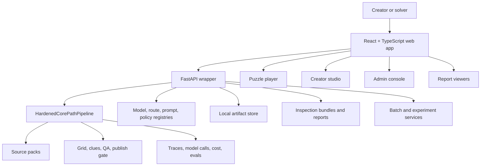

# Web App Plan

This plan defines the React + TypeScript web layer for CrosswordAI. The first build should ship a usable creator/admin studio and a playable crossword app backed by a FastAPI wrapper around the existing Python generation pipeline.

## Product Direction

Build both sides of the experience:

- **Creator studio:** a dark, dense, professional workspace for creating puzzle runs, reviewing sources, watching generation progress, inspecting QA, and preparing publishable artifacts.
- **Puzzle player:** a light, friendly, accessible crossword-solving experience that feels familiar to crossword fans and works well on desktop, tablet, and mobile.
- **Admin console:** local-first operational tools for registries, model routes, batch generation, experiments, evaluation reports, and production readiness.

The UI should use the `/uiInspiration` folder as visual direction:

- NYT-style crossword player references for the solving board, clue panels, toolbar, and direct interaction patterns.
- Classic crossword references for a simple, legible board-first solving experience.
- Dark SaaS/dashboard references for the creator studio, admin console, report viewers, and model/batch operations.
- Pink/red accent treatment from the inspiration set as a restrained interactive accent, not a dominant one-note palette.

## Technical Defaults

| Area | Decision |
| --- | --- |
| Frontend | React + TypeScript with Vite |
| Backend web layer | FastAPI wrapper over existing `crosswordai` modules |
| Frontend path | `web/` |
| API path | `src/crosswordai/web_api.py` |
| Package manager | npm unless the repo standard changes |
| Styling | CSS variables plus component-scoped CSS or CSS modules |
| Icons | `lucide-react` |
| Tests | TDD with Vitest, React Testing Library, Playwright, and axe accessibility checks |
| Auth | No auth for the first local MVP; admin surfaces are local-only |
| Data access | Browser reads artifacts through FastAPI, not directly from the filesystem |

## Architecture



The web layer should be treated as a product shell over the existing generation system, not as a separate generation implementation. The API should expose stable contracts around runs, artifacts, reports, registries, and batches.

## Build Sequence And Tickets

Ticket numbers are dependency order, not only product-area grouping. Build the smallest vertical slice first: API contracts, local app shell, puzzle generation workflow, playable puzzle, then admin/reporting sophistication.

### Stage 1: Web And API Foundation

Build the minimum reliable platform for frontend development, API integration, tests, and local operation.

| Ticket | Title | Scope | Acceptance Criteria | Tests |
| --- | --- | --- | --- | --- |
| WEB-001 | FastAPI service skeleton | Add `src/crosswordai/web_api.py` with app creation, health metadata, structured error shape, correlation IDs, and route-test harness. | `uvicorn crosswordai.web_api:app` starts locally and `GET /health` returns typed JSON. | FastAPI `TestClient` tests for health, error shape, and correlation ID. |
| WEB-002 | Shared contracts and fixtures | Define backend response models plus frontend-facing fixtures for puzzle, run, artifact, QA, report, registry, and batch shapes. | Frontend and backend agree on the initial JSON shapes before UI code depends on them. | Contract tests and fixture validation. |
| WEB-003 | Scaffold React app | Create `web/` with Vite, React, TypeScript, strict TS config, linting, formatting, and test scripts. | `npm install`, `npm run test`, and `npm run build` work from `web/`. | Smoke unit test for app shell. |
| WEB-004 | Typed API client | Add typed API client, error normalization, request timeout handling, retry policy for safe reads, and mock transport for tests. | Components do not call `fetch` directly. Errors display consistent user-facing states. | API client unit tests with success, failure, timeout, and malformed payload cases. |
| WEB-005 | Design tokens | Add color, typography, spacing, focus, z-index, board, and status tokens for dark studio and light player themes. | Theme tokens are centralized and documented in code. No hard-coded repeated colors in components. | Token import test and visual smoke test. |
| WEB-006 | App shell and routing | Add navigation and routes for dashboard, create puzzle, run detail, source review, player, reports, batches, experiments, registries, and admin readiness. | Each route renders a stable layout with accessible page title and navigation state. | Router tests and Playwright route smoke tests. |

### Stage 2: Creator Generation Vertical

Let a puzzle creator start a generation run, observe progress, inspect evidence, review QA, and decide whether a puzzle is publishable.

| Ticket | Title | Scope | Acceptance Criteria | Tests |
| --- | --- | --- | --- | --- |
| WEB-007 | Generation API slice | Implement source-pack, generation-run, run-list, run-detail, artifact, and player-safe puzzle read endpoints needed by the first creator workflow. | A UI can create a local generation request and read back run state without CLI usage. | FastAPI route tests using generated or fixture-backed artifacts. |
| WEB-008 | New puzzle workflow | Add a creation form for theme, notes, audience, difficulty, clue style, source preferences, model route, and budget guardrails. | Form validates required inputs and starts a source-pack or generation request. | Form validation tests and API submit test. |
| WEB-009 | Studio dashboard | Build a dark dashboard showing recent runs, publish status, quarantine counts, model cost, route health, and batch activity. | Creator can see what needs attention within one screen. | Component tests for empty, loading, populated, and error states. |
| WEB-010 | Generation run timeline | Show stages from source pack through candidates, grid, clues, QA, repair, publish gate, exports, and reports. | User can track current state, completed stages, failures, and artifacts. | Timeline rendering tests using run fixtures. |
| WEB-011 | Source review | Show source pack metadata, taxonomy, evidence snippets, rights status, source quality, vector retrieval notes, and graph entities. | Creator can inspect why content was trusted or blocked. | Fixture tests for approved, warning, and blocked evidence. |
| WEB-012 | Candidate and grid review | Show answer candidates, source support, duplicate/similarity flags, grid preview, grid constraints, and validation failures. | Creator can understand whether the puzzle structure is viable. | Grid preview and candidate table tests. |
| WEB-013 | Clue QA review | Show clue candidates, chosen clue, evidence IDs, QA flags, ambiguity, leakage, rights risk, difficulty, and repair history. | Failed clues are visually distinct and explain the blocking reason. | QA state tests and axe checks. |
| WEB-014 | Publish review | Show public-safe export summary, answer key controls, source map, QA scorecard, lineage, quarantine reasons, and open-in-player link. | Creator can open a generated puzzle or inspect why it was quarantined. | Publish/quarantine fixture tests. |

### Stage 3: Puzzle Player

Deliver a polished crossword-solving experience that is accessible, fast, and familiar.

| Ticket | Title | Scope | Acceptance Criteria | Tests |
| --- | --- | --- | --- | --- |
| WEB-015 | Player puzzle loader | Wire the player route to the player-safe puzzle endpoint and local puzzle fixtures. | The player can load a generated or fixture puzzle without exposing private evidence. | Loader tests for loading, not found, malformed, and success states. |
| WEB-016 | Crossword board model | Implement pure board logic for numbering, active cell, active answer, direction changes, entry, deletion, completion, and validation state. | Board behavior is tested before UI interaction code depends on it. | Unit tests for navigation, entry, deletion, and completion edge cases. |
| WEB-017 | Crossword board UI | Build an interactive grid with black squares, numbering, active cell, active answer highlighting, checked letters, and keyboard navigation. | Arrow keys, typing, backspace, delete, tab, shift-tab, and click selection work. | Component tests and Playwright keyboard tests. |
| WEB-018 | Clue panels | Add Across and Down clue lists with active clue sync, completed clue state, and mobile-friendly tabs. | Selecting a clue moves focus to the matching answer and vice versa. | Interaction tests for clue/grid sync. |
| WEB-019 | Solving toolbar | Add check cell, check word, reveal cell, reveal word, clear, timer, pause, print, and settings controls. | Controls are keyboard accessible and have icon labels/tooltips. | RTL tests for actions and axe checks. |
| WEB-020 | Player persistence and results | Save local progress by puzzle ID with version handling and show completion time, checked/revealed stats, metadata, and source-safe attribution. | Refreshing preserves entries and completion state; finishing the puzzle shows a results view. | Local storage tests, results fixture tests, and Playwright refresh test. |
| WEB-021 | Responsive player accessibility pass | Harden desktop, tablet, and mobile layouts, screen reader labels, high contrast, reduced motion, and touch targets. | No text overlap or unusable board states at common viewport sizes. | Playwright screenshots and axe checks at mobile, tablet, and desktop widths. |

### Stage 4: Admin And Operations

Expose the system sophistication in a usable admin surface after the core create-and-play loop works.

| Ticket | Title | Scope | Acceptance Criteria | Tests |
| --- | --- | --- | --- | --- |
| WEB-022 | Registry viewer | Show model, route, prompt, source connector, wordlist, policy, and output schema registries. | Admin can inspect active versions, metadata, and warnings. | Registry fixture tests. |
| WEB-023 | Batch generation UI | Add batch creation, checkpoint status, budget/cancellation state, per-theme outcome, and artifact links. | Admin can run or inspect large batches across themes and routes. | Batch lifecycle fixture tests. |
| WEB-024 | Experiment lab | Show model/route/prompt/retrieval/judge/repair experiment matrices, scorecards, and leaderboards. | Admin can compare multiple strategies before promotion. | Matrix rendering and sorting tests. |
| WEB-025 | Observability dashboard | Show model calls, latency, retry, cache hit rate, token/cost estimates, QA failure categories, and trace spans. | Admin can diagnose expensive or low-quality routes. | Metrics fixture tests and empty-state tests. |
| WEB-026 | Production readiness | Show secrets, environment, egress, RBAC, backup, disaster recovery, artifact signing, and storage readiness. | Admin can see blockers before production deployment. | Readiness status tests. |
| WEB-027 | Governance actions | Add UI stubs for promotion review, rollback plan display, shadow-mode status, and audit records. | The UI supports governance review before registry mutation work is automated. | Governance fixture tests. |

### Stage 5: Reports And Inspection

Make generated artifacts explainable enough for enterprise review and continuous improvement.

| Ticket | Title | Scope | Acceptance Criteria | Tests |
| --- | --- | --- | --- | --- |
| WEB-028 | Inspection bundle viewer | Show export manifest, checksums, artifact links, source map, answer hashes, and QA scorecard. | Reviewers can verify what was produced and by which route. | Artifact fixture tests. |
| WEB-029 | Clue lineage viewer | Show clue-by-clue evidence IDs, model route, prompt version, repair attempts, QA flags, and final decision. | Every published clue has a traceable explanation. | Lineage table tests. |
| WEB-030 | Source coverage report | Show source diversity, retrieval precision, stale-source flags, taxonomy classification, and evidence coverage gaps. | Weak data areas are visible before publishing. | Report chart tests. |
| WEB-031 | Model contribution report | Show which model/route contributed to each stage, cost, latency, cache status, and quality outcome. | Model usage is transparent and auditable. | Model report tests. |
| WEB-032 | Export and print views | Add print-friendly puzzle, answer key, QA summary, and admin report views. | Exports are readable and do not leak private evidence. | Print CSS snapshot and content tests. |

## API Plan

Initial endpoints should be small and stable:

| Method | Endpoint | Purpose |
| --- | --- | --- |
| `GET` | `/health` | Service health and version metadata |
| `POST` | `/api/source-packs` | Build a source pack from theme and notes |
| `GET` | `/api/source-packs/{id}` | Inspect source pack metadata, snippets, taxonomy, and rights state |
| `POST` | `/api/puzzles/generate` | Start a puzzle generation run |
| `GET` | `/api/runs` | List recent runs |
| `GET` | `/api/runs/{id}` | Inspect run state, timeline, outputs, and failures |
| `GET` | `/api/artifacts/{artifact_id}` | Read public-safe artifact content |
| `GET` | `/api/puzzles/{puzzle_id}` | Read player-safe puzzle JSON |
| `GET` | `/api/reports/{run_id}` | Read enterprise inspection report |
| `POST` | `/api/batches` | Start a batch generation request |
| `GET` | `/api/batches/{id}` | Inspect batch status and checkpoint outputs |
| `GET` | `/api/registries` | Inspect active registries |
| `GET` | `/api/admin/readiness` | Inspect production readiness status |

Backend implementation rules:

- Keep endpoints thin; call existing domain modules instead of duplicating generation logic.
- Return structured errors with code, message, details, and remediation hints.
- Include correlation IDs in responses and logs.
- Avoid exposing raw evidence text or private filesystem paths in player-safe responses.
- Add pagination to list endpoints before large batch output is exposed.

## Accessibility Requirements

The player should meet WCAG 2.2 AA expectations and be comfortable for long solving sessions.

- Full keyboard solving for grid, clue list, toolbar, dialogs, and settings.
- Visible focus states with sufficient contrast in both themes.
- Screen reader labels for cells, clue numbers, direction, blocked squares, entered letters, checked/revealed state, and toolbar actions.
- `aria-live` announcements for active clue changes, validation results, completion, pause/resume, and errors.
- Reduced-motion support for all animated transitions.
- High-contrast mode or contrast-safe token set.
- 44px minimum touch target for mobile controls where layout allows.
- No color-only status communication; pair color with icon, text, or pattern.
- Error copy should be direct and actionable.
- Timer and animations must pause cleanly.

## TDD Plan

Build each feature test-first where practical:

1. Write fixtures for API payloads and puzzle JSON.
2. Write unit tests for pure logic such as board navigation, answer selection, validation state, filtering, sorting, and formatting.
3. Write component tests for loading, empty, success, warning, error, and permission/local-only states.
4. Write API route tests for FastAPI endpoints before wiring the UI.
5. Write Playwright flows for create puzzle, inspect run, solve puzzle, review report, and inspect batch.
6. Add axe checks for player, create form, run detail, admin dashboard, and modal/dialog surfaces.
7. Use visual screenshots for the crossword board and responsive player layout.

Minimum test commands:

```bash
cd web
npm run test
npm run build
npm run test:e2e

cd ..
python3 -m unittest discover -s tests
```

## UI Design Requirements

Creator/admin studio:

- Dark workspace with compact density, strong hierarchy, restrained accent color, and dashboard-style information grouping.
- Persistent sidebar or top-level navigation for Dashboard, Create, Runs, Batches, Experiments, Registries, Reports, and Admin.
- Tables should support sorting, filtering, status chips, empty states, and compact metadata display.
- Report pages should favor readable tables and charts over decorative cards.
- Avoid nested cards and oversized marketing-style hero layouts.

Puzzle player:

- Light board-first interface with familiar crossword interactions.
- Grid should remain crisp, square, and stable across viewport changes.
- Clue text should be large enough for older solvers and never overlap controls.
- Mobile should prioritize the active clue, keyboard entry, and board visibility.
- Use icons for repeated toolbar actions with accessible labels and tooltips.

Shared UX:

- Show optimistic progress only when the backend confirms a state transition.
- Use skeletons for expected loading and direct error panels for failed operations.
- Every destructive or irreversible action should require confirmation.
- Prefer precise labels such as "Quarantined", "Publishable", "Needs Review", and "Blocked by Rights" over vague statuses.

## Milestones

| Milestone | Outcome | Included Tickets |
| --- | --- | --- |
| M1 | Local web/API foundation and typed contracts | WEB-001 through WEB-006 |
| M2 | Creator can start, inspect, and publish-review a run | WEB-007 through WEB-014 |
| M3 | Solver can load and play a generated puzzle | WEB-015 through WEB-021 |
| M4 | Admin can inspect registries, batches, experiments, observability, readiness, and governance | WEB-022 through WEB-027 |
| M5 | Enterprise reports are visible and exportable | WEB-028 through WEB-032 |

## Definition Of Done

A ticket is complete only when:

- It has passing unit or route tests.
- User-facing states cover loading, empty, success, warning, and error where applicable.
- Keyboard access and screen reader labels are verified for interactive UI.
- It uses typed API contracts or validated fixtures.
- It does not expose private evidence, secrets, raw filesystem paths, or unsafe artifacts.
- It has responsive behavior checked at mobile, tablet, and desktop widths.
- It fits the split-theme visual direction.

The web MVP is complete when a local user can start a generation run, inspect its sources and QA, open a generated puzzle in the player, solve it, and review admin/reporting surfaces without using the CLI for the main workflow.
